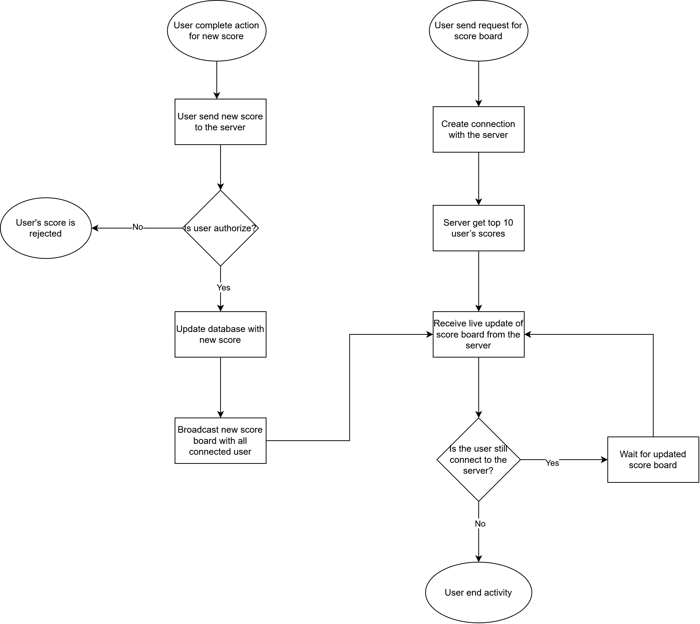

**# API Service Module Specification: Live Scoreboard**

## **1. Overview**
This module handles real-time score updates for a website scoreboard that displays the top 10 user scores. It provides an API endpoint for showing and updating scores upon user completing an action while ensuring security against unauthorized modifications.

## **2. Functional Requirements**
1. **Scoreboard Retrieval:** API to get top 10 user score

2. **Scoreboard Update:** API endpoint for updating a user's score.
3. **Real-Time Scoreboard Updates:** Use WebSocket to push update to connected user
4. **Security & Validation:**
    - Authenticate API calls using a token-based authentication system
    - Rate limit user to prevent abuse
    - Logging to monitor suspicious activities


## **3. Execution Flow Diagram**


## **4. API Endpoints**
### **4.1 Get Top 10 Scores**
**Endpoint:** `GET /scores`

**Response example:**
```json
[
  {"user_id": "user1", "score": 1500},
  {"user_id": "user2", "score": 1400},
  {"user_id": "user3", "score": 1300},
  {"user_id": "user4", "score": 1200},
  {"user_id": "user5", "score": 1100},
  {"user_id": "user6", "score": 1000},
  {"user_id": "user7", "score": 900},
  {"user_id": "user8", "score": 800},
  {"user_id": "user9", "score": 700},
  {"user_id": "user10", "score": 600},
]

```
### **4.1 Update Score**
**Endpoint:** `POST /scores`

**Request:**
```json
{
  "user_id": "<user_id>",
  "score": "<score>"
}
```

**Response example:**
```json
{
  "success": true,
}
```

## **5. Real-Time Update Mechanism**
1. Database is updated when server receives a valid score.
2. WebSocket server broadcasts the new leaderboard to all connected client
3. Clients listen for events and update the UI accordingly 